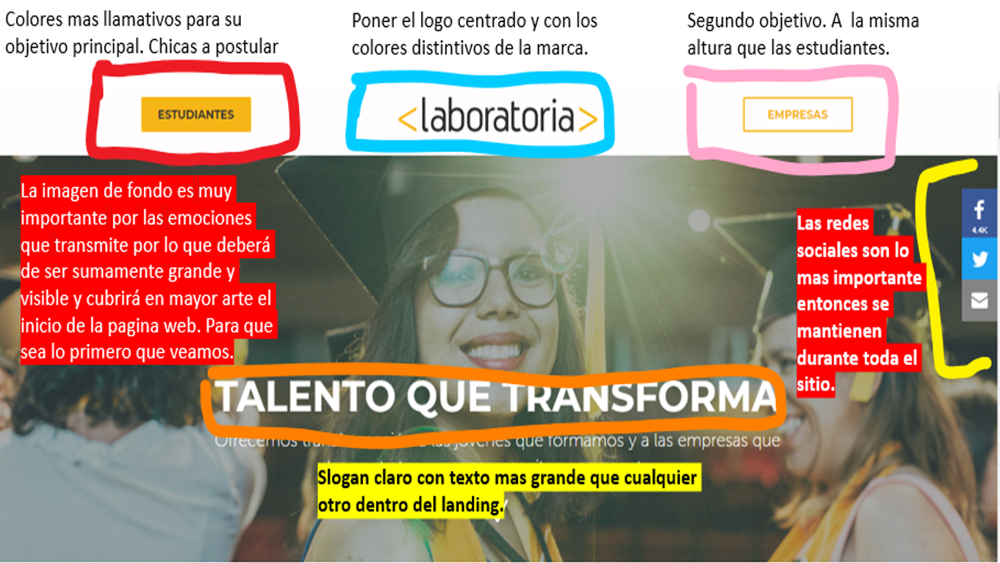
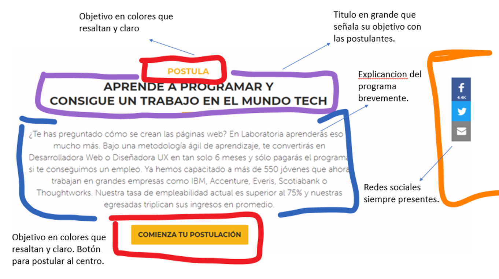
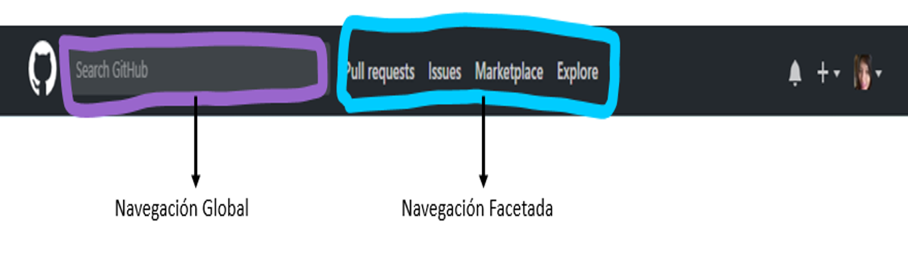
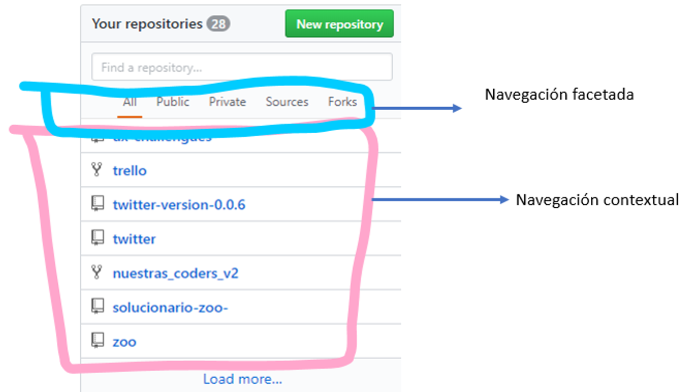
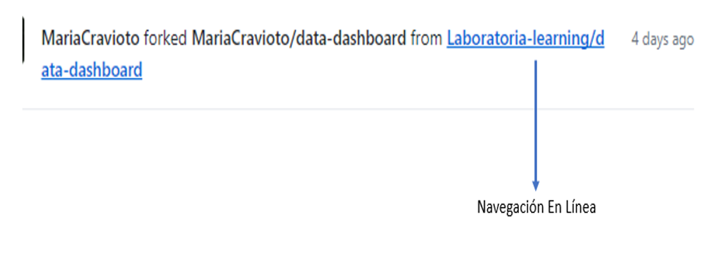
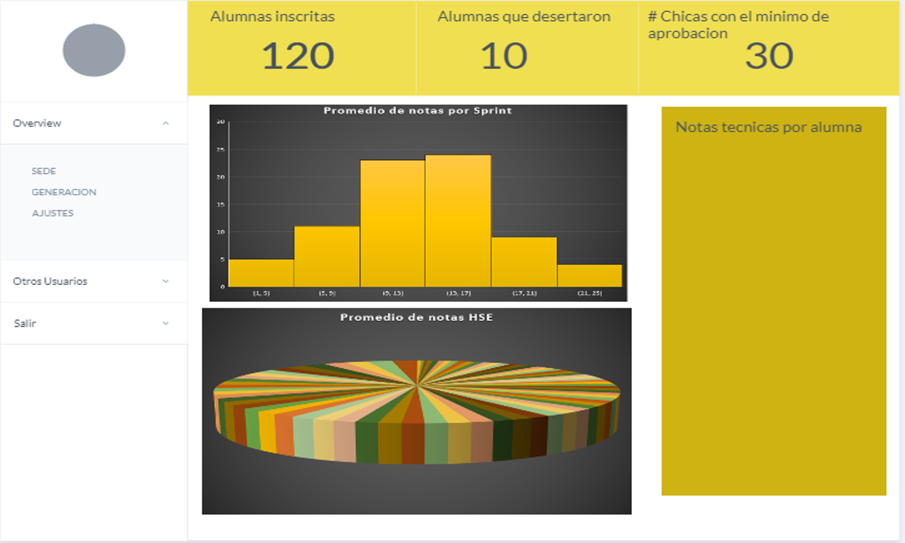

# **1 LABORATORIA ANALISIS UX & UI**
* UX ¿Por qué?
	- www.laboratora.la (website) se crea con el objetivo de llamar la atencion de chicas de para que **postulen** a su programa de 6 meses (bootcamp). Que podemos definir como su _plan de negocio_.

### _¿Por qué?_ Aspectos a evaluar **UX** 
* Logo : Tener tu logo en la pagina web es de suma importancia ya que de esa manera das a conocer tu marca, es por eso que el diseñador ux decide que es importante incluirlo en el sitio. 
* Imagen de la chica graduada y feliz : UX esta enfocado a hacer sentir, a las emociones que se pueden generar en el usuario a partir de algo que se encuentra en la web. Por lo que en este caso parece importante poner una imagen de una chica graduada (_el cual es el objetivo de laboratoria_), despues de los 6 meses de bootcamp y ver la felicidad que le representa el verse realizada despues de haber completado su objetivo.
* Slogan : Un slogan es sumamente importante para que aparte de tu logo seas recordado por una frase, y cada que el usuario lo vea reconozca o se le venga a la mente esa frase (_**'Talento que transforma'**_).
* **Redes sociales** : Las redes sociales en estos tiempos son my imprtantes, ya que la mayoria de los usuarios confiamos mas en una pagina si vemos que son activos en sus redes sociales y si hay comentarios positivos. Es por eso que para Laboratoria es tan importante que las redes sociales esten presentes a todo momento, ya que sin duda aumentan su credibilidad. 
* Botones: Laboratoria tiene como objetivo dos publicos:
	Por los cuales es importante delimitar la informacion para cada uno
	- Estudiantes
	- Empresas
* Boton para postular.
	- Si postular es el ojetivo de Laboratoria, voy a poner la oportunidad de hacerlo en varias partes del sitio. De esta manera no dejo que el usuario olvide esto. 
* Testimonio (Ex- alumna) (_enfocado a alumnas_).
	- Regresando al tema de las emociones. Para Laboratoria es importante dar a conocer sus exitos y de esa manera atraer a mas chicas a lograr sus propios exitos tambien. Incluyendo testimonios en el sitio de ex-alumnas que han logrado grandes cosas, motivas a las chicas que lo puedan leer.
* Resumen que es y como trabaja (_enfocado a empresas_): Para laboratoria es importante mostrar el plan de trabajo que sigue y asi las empresas puedan sentir confianza y empatia por lo que hacen.
* Testimonio empresas (_enfocado a las empresas_): Para las empresas hoy en dia es muy importante contar con personal altamente capacitado, por lo que sin duda es conveniente dar testimonios en los cuales chicas de laboratoria han sido contratadas por otras empresas de confianza. Lo cual invita a mas empresas a apostar por ese talento.

### _¿Como?_ Aspectos a evaluar **UI**

Entonces, concluimos que UX es el _¿Por qué?_ de mi sitio y de todo lo que deseo incluir.
¿Donde queda el UI?

El UI nos va a ayudar a hacer toda la magia dentro del sitio para ayudar a que los objetivos de UX se cumplan.
**Entonces define colores, posiciones de imagenes, tipos de letras, etc**

Veamos el analisis: 

1. Si nos damos cuenta, utilizaran los mismos colores a lo largo de la Página, por lo cual se jugara con las combinaciones posibles.
	- Por ejemplo en los botones para estuiantes (_que es el mas importante_) utilizamos el color amarillo y las letras en negro. Mientras que para las empresas se le da un color amarillo unicamente con el fondo blanco. 

# **Identificando los Elementos de Navegación en Github**

De acuerdo a los conceptos proporcionados en el self learning. Hare un análisis de los diferentes tipos de navegación que podemos encontrar en github.

Primero verifiquemos los conceptos: 

- **Global**
Es la navegación principal del site. Normalmente es persistente y nos ayuda a explorar todas las opciones del site.

- **Local**
Es la navegación “localizada” a una página o vista. En algunos casos, algunas páginas internas tienen su propia navegación que ayuda al usuario a explorar esa vista en particular.

- **Facetada** 
Es la navegación a través de filtros no editables, definidos previamente por el sistema.

- **Filtrada**
En este tipo de navegación le damos al usuario todos los resultados de la búsqueda y le damos una serie de opciones de filtros para que él mismo pueda filtrar.

- **Contextual**
Es la navegación acorde al contexto en el que está navegando el usuario. Se usa principalmente para recomendaciones.

- **En línea (inline)**
Son links de referencia utilizados principalmente en artículos.

- **Suplementaria**
Es la navegación adicional, a veces temporal, utilizada para señalar algunas funciones a nuevos usuarios.

_Entonces veamos el analisis en las siguientes imagenes_ 

# Dashboard

A continuacion Sketch para el Dashboard de Laboratoria

